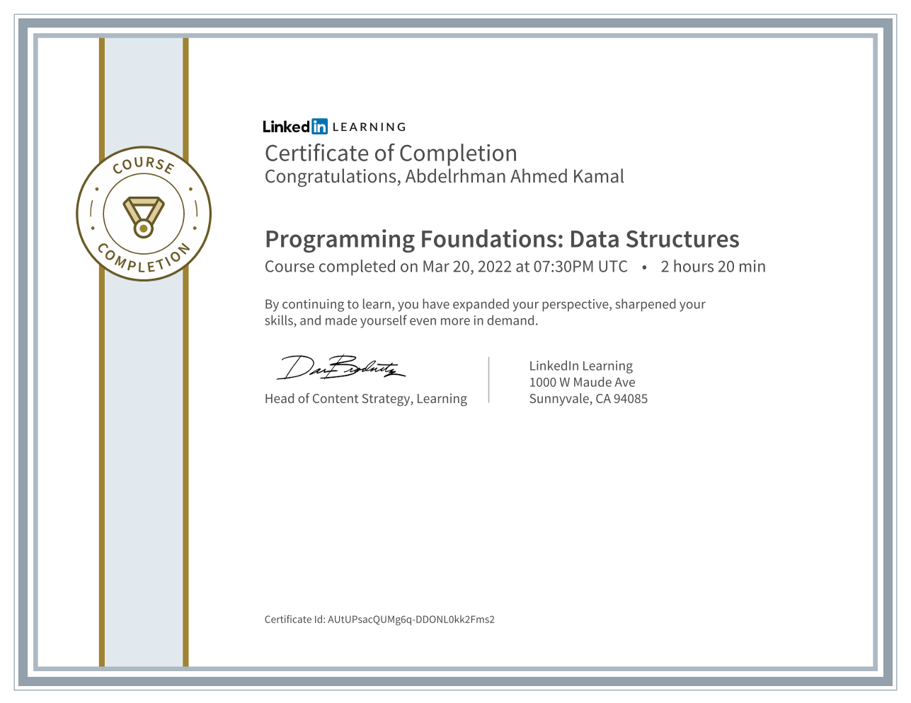

# Programming Foundations: Data Structures

### Code Summary and Explanation

- [**Section 1:** Introduction to data and data type](./course-code-and-explanation/1-Introduction-to-data-and-data-type/)
- [**Section 2:** Arrays](./course-code-and-explanation/2-Arrays/)
- [**Section 3:** Lists ](./course-code-and-explanation/3-Lists/)
- [**Section 4:** Stacks and queue](./course-code-and-explanation/4-Stacks-and-Queues/)
- [**Section 5:** Hash based data structure ](./course-code-and-explanation/5-Hash-based-data-structure/)
- [**Section 6:** Trees and graphs](./course-code-and-explanation/6-Trees-and-Graphs/)

---

### [Challenges](./Challenges/)

---

### Course details

- Once you get past simple programs with one or two variables, you'll use data structures to store the values in your applications. Data structures are like containers—there's one for every kind of data. While structures like arrays and queues are sometimes taken for granted, a deeper understanding is vital for any programmer who wants to know what's going on "under the hood" and understand how the choices they've made impact the performance and efficiency of their applications. In this course, Kathryn Hodge provides an in-depth overview of the most essential data structures for modern programming. Starting with simple ways of grouping data, like arrays and structs, Kathryn gradually introduces more complex data structures, such as linked lists, stacks and queues, hash tables, and trees and graphs. Each lesson is accompanied by a real-world, practical example that shows the data structures in action. When you're finished with the course, you'll have a clear understanding of data structures and understand how to use them—in whatever language you're programming in: C#, Swift, JavaScript, Java, Python, and more.

---

### Learning objectives

- Data types: Booleans, numbers, strings, and more
- Multidimensional arrays
- Jagged arrays
- Search and sort arrays
- Linked lists
- Stacks and queues
- Hash functions and hash tables
- Trees and graphs

---

[Course Link](https://www.linkedin.com/learning/programming-foundations-data-structures-2/)
 [Preview Certificate](https://www.linkedin.com/learning/certificates/d0a30953390ef4da8bdcd207e8b5200b03b81779978de2261985150f5384ec80?lipi=urn%3Ali%3Apage%3Ad_flagship3_profile_view_base_certifications_details%3B9znAdOUJTu2aYA5T5YqZLQ%3D%3D)

## [Next Course](../-05-Programming-Foundations-Algorithms/)

### [Back To LinkedIn Courses](../)
