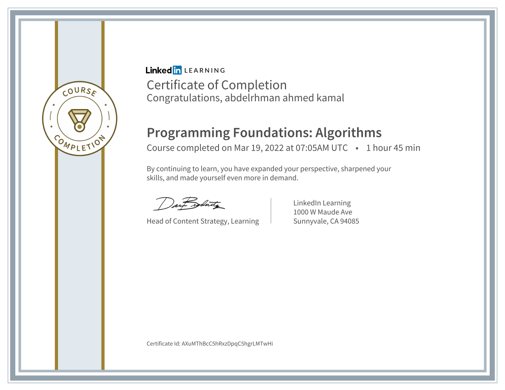

# Programming Foundations: Algorithms

### Code Summary and Explanation

- [**Section 1:** Introduction](./course-code-and-explanation/1-Introduction/)
- [**Section 2:** Data Structure](./course-code-and-explanation/2-Data-structure/)
- [**Section 3:** Recursion ](./course-code-and-explanation/3-Recursion/)
- [**Section 4:** Sorting](./course-code-and-explanation/4-Sorting/)
- [**Section 5:** Searching ](./course-code-and-explanation/5-Searching/)
- [**Section 6:** other algorithms](./course-code-and-explanation/6-Other-Algorithms/)

---

### [Challenges](./Challenges/)

---

### Course details

- Algorithms are the universal building blocks of programming. They power the software you use every day, whether it's a spreadsheet, a social network, or a driving assistant. Algorithms offer a way to think about programming challenges in plain English, before they are translated into a specific language like C# or JavaScript. In this course, author and developer Joe Marini explains some of the most popular and useful algorithms for searching and sorting information, working with techniques like recursion, and understanding common data structures. He also discusses the performance implications of different algorithms and how to evaluate the performance of a given algorithm. Each algorithm is shown in practice in Python, but the lessons can be applied to any programming language.

---

### Learning objectives

- Measuring algorithm performance
- Working with data structures such as arrays, stacks, and queues
- Looping and recursion
- Sorting data
- Searching data
- Filtering and value counting with hash tables

---

[Course Link](https://www.linkedin.com/learning/programming-foundations-algorithms/)
 [Preview Certificate](https://www.linkedin.com/learning/certificates/d07b586ff5cf840a2ab332fc79410f161639f9d61f17ed9958391ee15f5cfd4a?lipi=urn%3Ali%3Apage%3Ad_flagship3_profile_view_base_certifications_details%3B9znAdOUJTu2aYA5T5YqZLQ%3D%3D)

## [Next Course](../-06-Programming-Foundations-Design-Patterns/)

### [Back To LinkedIn Courses](../)
