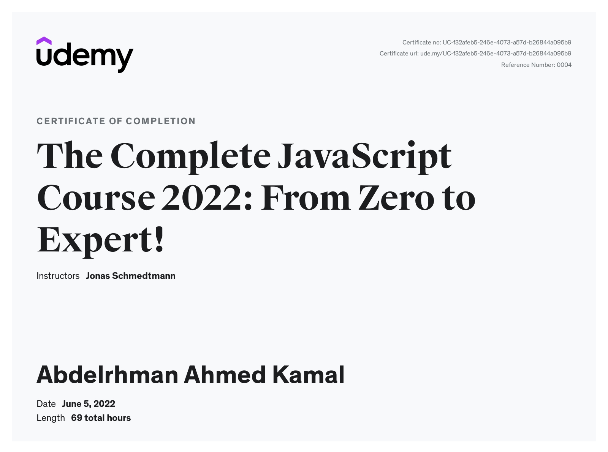

# The Complete JavaScript Course 2022: From Zero to Expert!

## Challenges

- [x] [JavaScript Fundamentals – Part 1 ](./Challenges/JavaScript%20Fundamentals%20%E2%80%93%20Part%201/)
- [x] [JavaScript Fundamentals – Part 2](./Challenges/JavaScript%20Fundamentals%20%E2%80%93%20Part%202/)
- [x] [Developer Skills & Editor Setup ](./Challenges/Developer%20Skills%20%26%20Editor%20Setup/)
- [x] [JavaScript in the Browser: DOM and Events](./Challenges/JavaScript%20in%20the%20Browser%20DOM%20and%20Events/)
- [x] [Data Structures, Modern Operators and Strings.](./Challenges/Data%20Structures%2C%20Modern%20Operators%20and%20Strings/)
- [x] [A Closer Look at Functions](./Challenges/A%20Closer%20Look%20at%20Functions/)
- [x] [Working With Arrays.](./Challenges/Working%20With%20Arrays/)
- [x] [Object Oriented Programming (OOP)](<./Challenges/Object%20Oriented%20Programming%20(OOP)/>)
- [x] [Asynchronous JavaScript](./Challenges/Asynchronous%20JavaScript/)

---

## Course Code And explanation

- [Fundamentals 1](./Code/a-fundamentals%231/)
- [Fundamentals 2](./Code/b-fundamentals%232/)
- [developer skills](./Code/c-developer-skills/)
- [Games](./Code/d-games/)
- [Data Structure and operations](./Code/e-data-structures-and-operations/)
- [How JS works behind the scenes](./Code/e-How-js-work-behind-the-scenes/)
- [Closer look at functions](./Code/f-functions/)
- [Arrays](./Code/g-arrays/)
- [Numbers, Date and time](./Code/h-numbers-date-time/)
- [Dom Manipulation](./Code/i-DOM-minpulation/)
- [Object Oriented Programming](./Code/j-OOP/)
- [Mapty and GeoLocation](./Code/k-Mapty/)
- [Async JavaScript](./Code/m-Asynchronous-JavaScript%2CAJAX%2CAPIs/)
- [JS development](./Code/n-js-development/)

---

## Projects

### Pig Game

- [Project-code](https://github.com/abdelrhman-ahmed-kamal/pig-game/)
- [Live Demo](https://abdelrhman-ahmed-kamal.github.io/pig-game/)

### Bankist

- [Project-code](https://github.com/abdelrhman-ahmed-kamal/bankist)
- [Live Demo](https://abdelrhman-ahmed-kamal.github.io/bankist/)

### Bankist Site

- [Project-code](https://github.com/abdelrhman-ahmed-kamal/bankist-website/)
- [Live Demo](https://abdelrhman-ahmed-kamal.github.io/bankist-website/)

### Mapty

- [Project-code](https://github.com/abdelrhman-ahmed-kamal/mapty/)
- [Live Demo](https://abdelrhman-ahmed-kamal.github.io/mapty/)

### Forkify

- [Project-code](https://github.com/abdelrhman-ahmed-kamal/forkify)
- [Live Demo](https://abdelrahman-forkify.netlify.app/)

---

[Course-Link](https://www.udemy.com/course/the-complete-javascript-course/)
 

[Certificate](https://www.udemy.com/certificate/UC-f32afeb5-246e-4073-a57d-b26844a095b9/)

