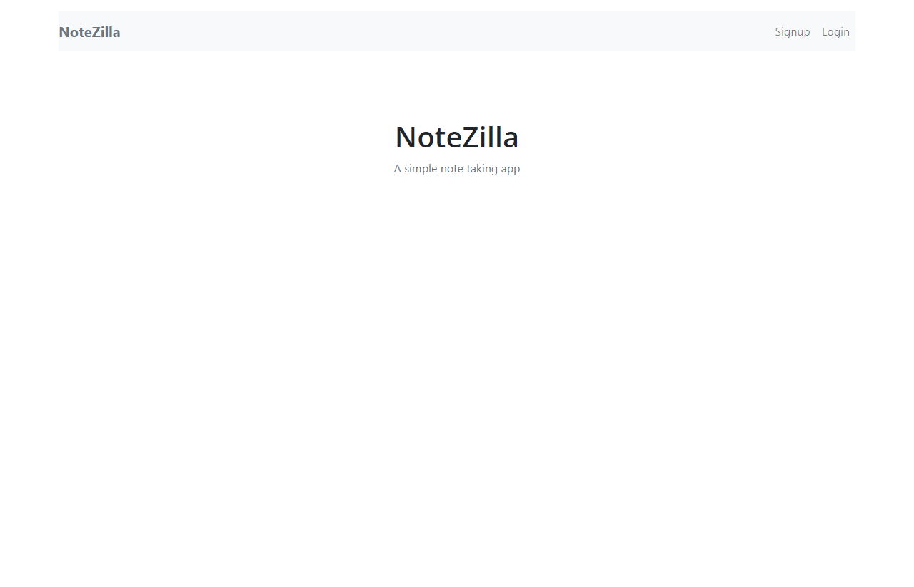

# Serverless-Stack-project.

[Serverless-Stack-Guide](https://serverless-stack.com/#guide)

## Project

[code](https://github.com/abdelrhman-ahmed-kamal/Notezilla-app)

## [Demo](https://d36pfzmwqzyqcp.cloudfront.net/)

 

## Screenshots

## Features

- allow users to create accounts and login
- allows users to create notes and upload files
- allows user to add billing details
- allows users to access their notes from anywhere
